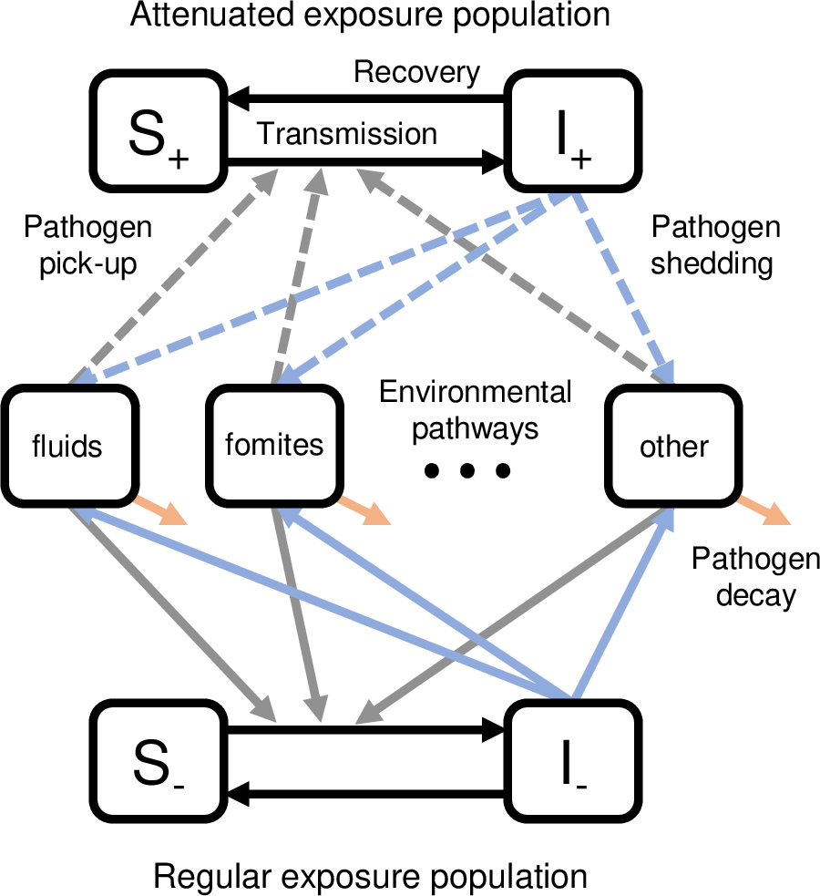

```{r setup, include=FALSE}
knitr::opts_chunk$set(echo = TRUE)

```

## SISE-RCT model

The SISE-RCT model is a compartmental infectious disease transission model for enteric pathogens that uses a susceptible-infectious-susceptible (SIS) framework and environmental (E) transmission. It is used to predict the effectiveness of an intervention in a water, sanitation, and hygiene (WASH) randomized controlled trial (RCT) as a function of the intervention coverage ($\omega$), compliance ($\rho$), the fraction of people not in the study who have WASH conditions comparable to the intervention ($\rho_0$), the intervention efficacy of reducting transmission ($1-\phi_\beta$) or shedding ($1-\phi_\alpha$), the transmission potential measured by the basic reproduction number ($\mathcal{R}_0$), and the fraction of transmission that is along pathways that can be intervened on ($\eta$). 

In both the control and intervention arms, there is a population ($S_+$, $I_+$) who have attenuated exposure from the intervention of substantively equivalent baseline conditions, and there is a population ($S_-$, $I_-$) that has regular exposure.

<center>
<div style="width:25%; height:25%">

</div>
</center>

The fraction of the population in a shared environment with the intervention or preexisting condition is $\omega\rho + (1-\omega)\rho_0$.
For one shared environment, the prevalence of the disease in the population at steady state can be found by simulating the following equations to steady state. (These equations are not biologically meaningful on their own, but the simulate the same steady state as the system we're interested in.)

$$
\begin{align}
\frac{dS_+}{dt} & = -(\phi_\beta\cdot\mathcal{R}_0\cdot\eta\cdot (\phi_\alpha\cdot I_++I) + \mathcal{R}_0\cdot (1-\eta)\cdot (\phi_\alpha\cdot I_++I))\cdot S_+ +I_+\\
\frac{dI_+}{dt} & = (\phi_\beta\cdot \mathcal{R}_0\cdot\eta\cdot (\phi_\alpha\cdot I_++I) + \mathcal{R}_0\cdot (1-\eta)\cdot (\phi_\alpha\cdot I_++I))\cdot S_+ -I_+\\
\frac{dS_-}{dt} & = -\mathcal{R}_0\cdot (\phi_\alpha\cdot I_++I)\cdot S_+ +I_+\\
\frac{dI_-}{dt} & = \mathcal{R}_0\cdot(\phi_\alpha\cdot I_++I)\cdot S_+ -I_+
\end{align}
$$


More details on the model are available in Brouwer et al. (2024) <https://doi.org/10.1101/2024.03.09.24304020>, as well as previous work Brouwer et al. (2022)
<https://doi.org/10.1371/journal.pcbi.1010748> and Brouwer et al. (2022)
<https://doi.org/10.1101/2022.11.15.22282349>.