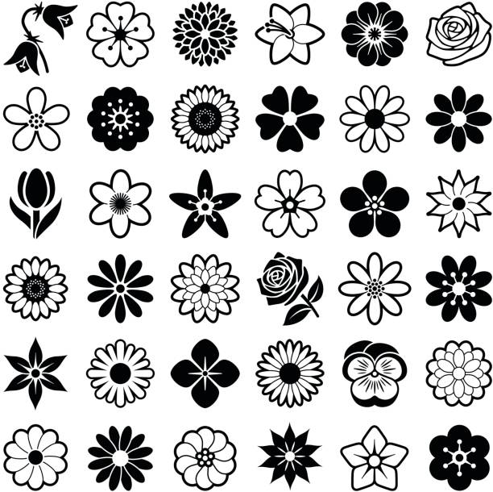

# About Page

Here we'll put information about the application and your paper.

We can even insert images:

And do math:

When $a \ne 0$, there are two solutions to $(ax^2 + bx + c = 0)$ and they are
$$ x = {-b \pm \sqrt{b^2-4ac} \over 2a} $$

---
