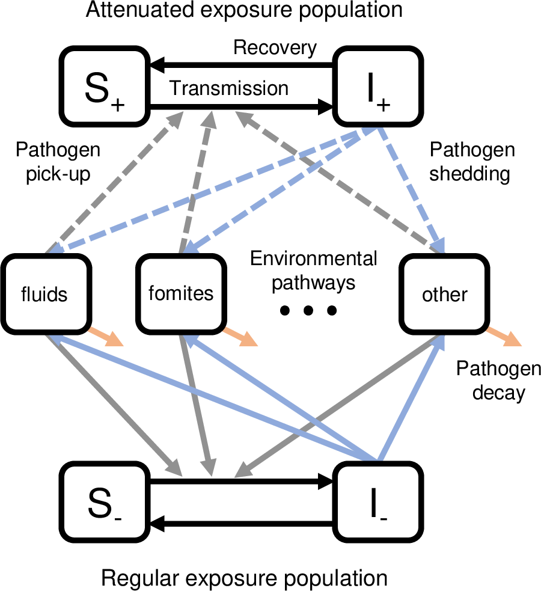

## SISE-RCT model

The SISE-RCT model is a compartmental infectious disease transmission model for enteric pathogens that uses a susceptible-infectious-susceptible (SIS) framework and environmental (E) transmission. It is used to predict the effectiveness of an intervention in a water, sanitation, and hygiene (WASH) randomized controlled trial (RCT) as a function of the intervention coverage ($\omega$), compliance ($\rho$), the fraction of people not in the study who have WASH conditions comparable to the intervention ($\rho_0$), the intervention efficacy of reducing transmission ($1-\phi_\beta$) or shedding ($1-\phi_\alpha$), the transmission potential measured by the basic reproduction number ($\mathcal{R}_0$), and the fraction of transmission that is along pathways that can be intervened on ($\eta$).

In both the control and intervention arms, there is a population ($S_+$, $I_+$) who have attenuated exposure from the intervention of substantively equivalent baseline conditions, and there is a population ($S_-$, $I_-$) that has regular exposure.

